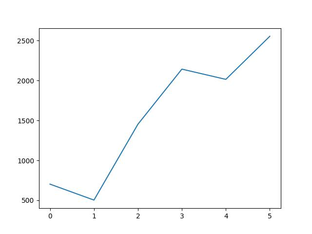

# KittyAI: Reinforcement Learning for Kitty Kitten War

## Project Overview
KittyAI is an advanced reinforcement learning implementation for the game "Kitty Kitten War." In this project, I developed a sophisticated AI agent that learns to play as KarenCat through deep reinforcement learning techniques. The human player controls BakerCat, creating an interactive environment where you can both play against and train the AI.

## Training Visualization
The training process is monitored with real-time metrics tracking:


*Evolution of Q-values during training, showing the agent's improving ability to estimate action values*


*Cumulative rewards per episode, demonstrating the agent's learning progress*


*Episode length over time, showing how the agent learns to survive longer*

## AI Implementation Highlights

### Deep Q-Network Architecture
- **Dueling DQN**: Implemented a dueling architecture that separates state value and action advantage estimation
- **Attention Mechanism**: Added an attention layer to help the agent focus on relevant parts of the state space
- **Prioritized Experience Replay**: Enhanced learning efficiency by prioritizing important experiences
- **Double DQN**: Reduced overestimation bias by decoupling action selection and evaluation

### Advanced Reinforcement Learning Features
- **Curriculum Learning**: Progressive difficulty levels to improve training efficiency
- **Strategic Exploration**: Smart exploration strategy that balances exploitation with targeted exploration
- **Opponent Modeling**: The AI tracks and adapts to the human player's behavior patterns
- **Adaptive Reward Shaping**: Sophisticated reward function that encourages strategic gameplay

## Game Overview

### Characters
- **KarenCat (AI-controlled)**: Uses abilities like "Annoy Customer," "Salt Cakes," and "Write Bad Yelp Review"
- **BakerCat (Human-controlled)**: Defends the bakery with abilities like "Serve Customer," "Give Free Samples," and more

### How to Play
Start the game by hitting the enter key. You'll control BakerCat using these controls:

- **Movement**: W, A, S, D keys
- **Serve Customer**: Z key (must be close to customer)
- **Give Free Samples**: X key (can be used anywhere)
- **Activate Pusheen Wall**: V key (can be used anywhere)
- **Cut Off Wifi**: C key (must be close to the laptop)

### Training Mode
You can also train the AI by playing against it:
1. The game will prompt you for Baker commands
2. After each of your moves, the AI will make its move
3. The AI learns from these interactions, improving over time

### Playing Against Checkpoints
The game allows you to play against saved AI checkpoints:
1. Choose the "Play against checkpoint" option when prompted
2. Select from available checkpoints, including the pre-trained models
3. The AI demonstrates remarkable learning after just 5 epochs of training
4. You'll notice the AI exploits an effective strategy of standing next to customers and spamming actions

### Training Options
You have multiple ways to train the AI:
1. **Play Against AI**: Train by playing as BakerCat against the learning AI
2. **Random Actions Training**: Let the AI train against random actions for faster iteration
3. **Continue from Checkpoint**: Resume training from a previously saved model

## Technical Implementation
- **State Representation**: Combines spatial features, game state, and strategic information
- **Neural Network**: Multi-branch network with attention mechanism and dueling architecture
- **Hyperparameter Tuning**: Carefully optimized learning rate, discount factor, and exploration parameters
- **Checkpointing**: Automatic saving of the best models during training

## Future Improvements
- Implementing a fully convolutional network for better spatial reasoning
- Adding self-play capabilities for autonomous training
- Exploring multi-agent reinforcement learning approaches

## Getting Started
To run the game and interact with the AI:

```bash
python input_handler.py
```

To train a new AI model from scratch or continue training from a checkpoint, follow the prompts after starting the program.

## Technologies Used
- TensorFlow/Keras
- NumPy
- Pygame
- Socket Programming for Agent-Game Communication
- OpenCV for Image Processing

